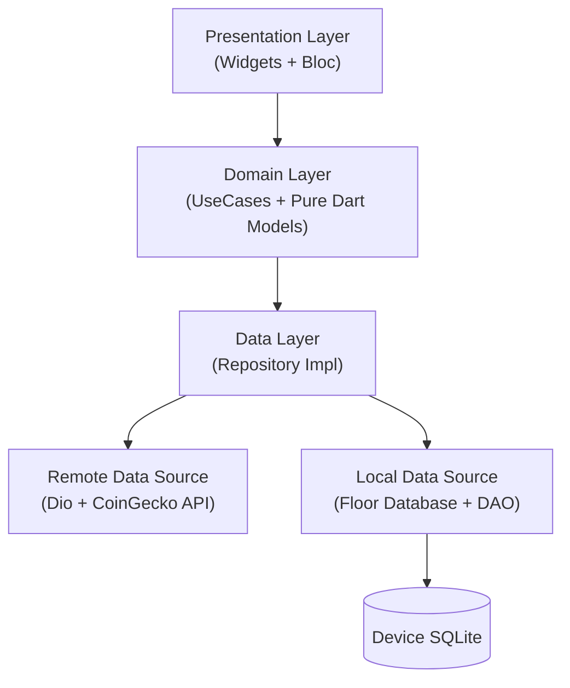

# CryptoWatch (Flutter)


**CryptoWatch** is a high-fidelity, **offline-first** cryptocurrency tracker rebuilt from the ground up using **Flutter**. It demonstrates industry-standard cross-platform development practices, featuring strict **Clean Architecture**, database-driven UI, infinite scrolling, and background synchronization using Isolates.

---

## Screenshots

| Market List (Infinite Scroll) | Coin Detail (Interactive Charts) |
|:-------------------------:|:-------------------------:|
|  |  |
| *Real-time market data with Custom Painted Sparklines* | *Detailed stats with smooth Hero transitions* |

---

## Download

Try the latest release on your Android device:

[](https://github.com/EngFred/CryptoWatch/releases/download/v1.0/CryptoWatch.apk)

---

## Key Features

* **Offline-First Architecture**: Uses a "Single Source of Truth" approach. The UI **only** observes the Local Database (Floor); the Network layer works silently to refresh the cache. The app functions fully in Airplane mode.
* **Hybrid Search Engine**: Instantly searches the local SQLite cache via **Debounced Events**. If local results are insufficient, it transparently triggers a remote API search, caches the result, and streams updates to the UI.
* **Infinite Pagination**: Implemented using the **Infinite Scroll Pagination** package, decoupling the UI from the data fetching logic.
* **Isolate-Based Background Sync**: Utilizes **Workmanager** to spawn a dedicated background Isolate that wakes up the app (even when closed) to sync high-priority market data.
* **Performance Optimized**: Heavy computations (like JSON parsing) and UI rendering (like **Sparkline Charts**) are optimized. Charts are drawn using `CustomPainter` for maximum frame rates.
* **Event-Driven State Management**: Strictly typed **Bloc** pattern (Events & States) ensures predictable data flow and easy testing.

---

## Tech Stack

* **Framework**: [Flutter](https://flutter.dev/) & [Dart](https://dart.dev/)
* **State Management**: [Flutter Bloc](https://pub.dev/packages/flutter_bloc) (Strict Event-Driven)
* **Architecture**: Clean Architecture (Presentation, Domain, Data)
* **Dependency Injection**: [GetIt](https://pub.dev/packages/get_it) + [Injectable](https://pub.dev/packages/injectable) (Code Generation)
* **Network**: [Dio](https://pub.dev/packages/dio) (Interceptors & Error Handling)
* **Local Database**: [Floor](https://pub.dev/packages/floor) (SQLite abstraction similar to Room)
* **Navigation**: [GoRouter](https://pub.dev/packages/go_router) (Deep linking & Custom Transitions)
* **Pagination**: [Infinite Scroll Pagination](https://pub.dev/packages/infinite_scroll_pagination)
* **Background Tasks**: [Workmanager](https://pub.dev/packages/workmanager)
* **Equality**: [Equatable](https://pub.dev/packages/equatable)

---

## Architecture

The app follows strict **Clean Architecture** principles to ensure separation of concerns.



* **Domain Layer**: Contains pure business logic (UseCases) and plain Dart models. It has **zero** dependencies on Flutter or data libraries.
* **Data Layer**: Handles data coordination. The Repository Implementation decides whether to fetch from the API or return cached data.
* **Presentation Layer**: Blocs transform `Events` into `States` for the Flutter Widgets to render.

---

## Getting Started

1.  **Clone the repository**:
    ```bash
    git clone [https://github.com/EngFred/CryptoWatch--Flutter.git](https://github.com/EngFred/CryptoWatch--Flutter.git)
    cd flutter_cryptowatch
    ```

2.  **Install Dependencies**:
    ```bash
    flutter pub get
    ```

3.  **Run Code Generator**:
    This project uses `build_runner` for DI, JSON serialization, and Database code.
    ```bash
    flutter pub run build_runner build --delete-conflicting-outputs
    ```

4.  **Run the App**:
    ```bash
    flutter run
    ```